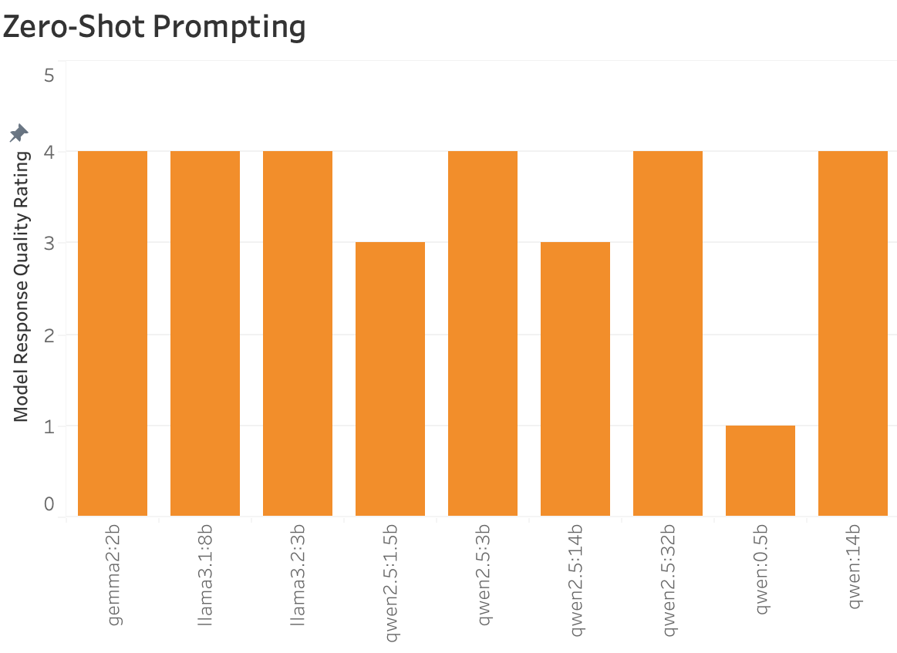
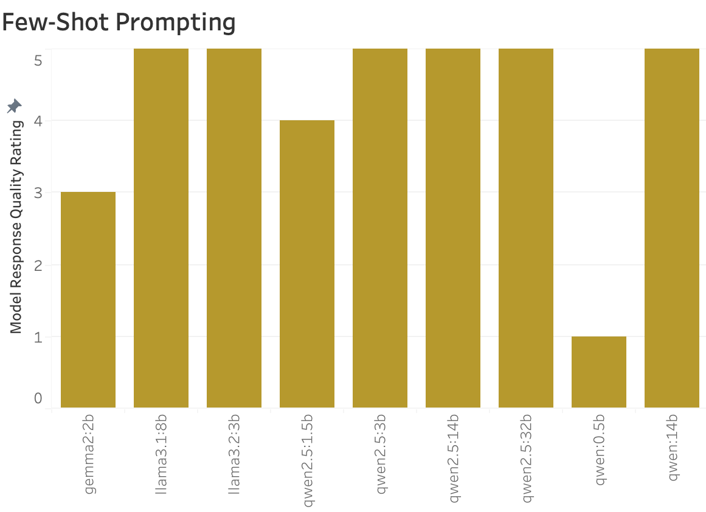
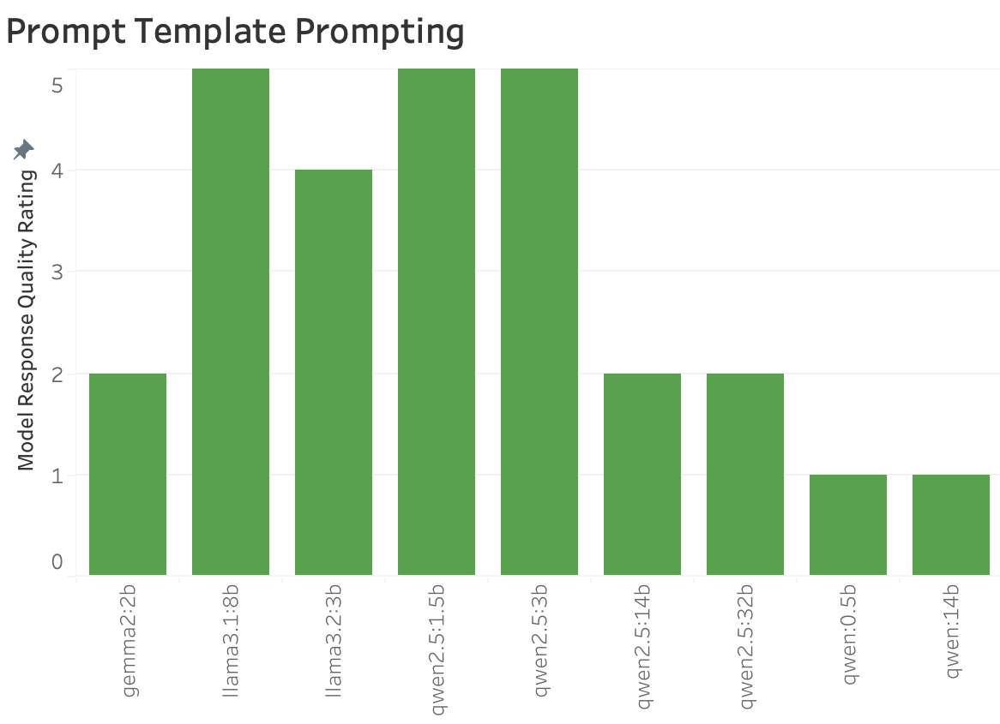
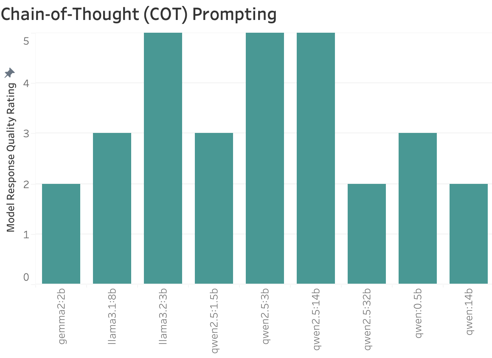
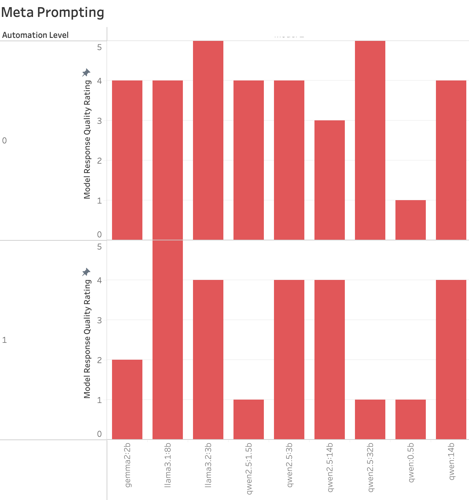
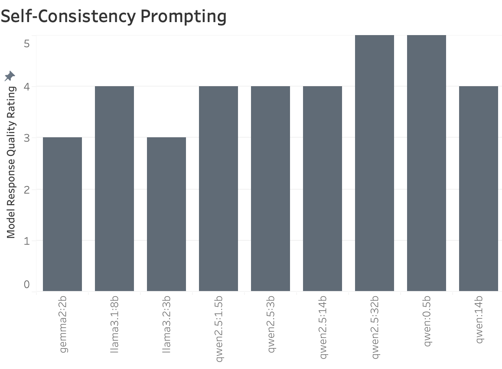
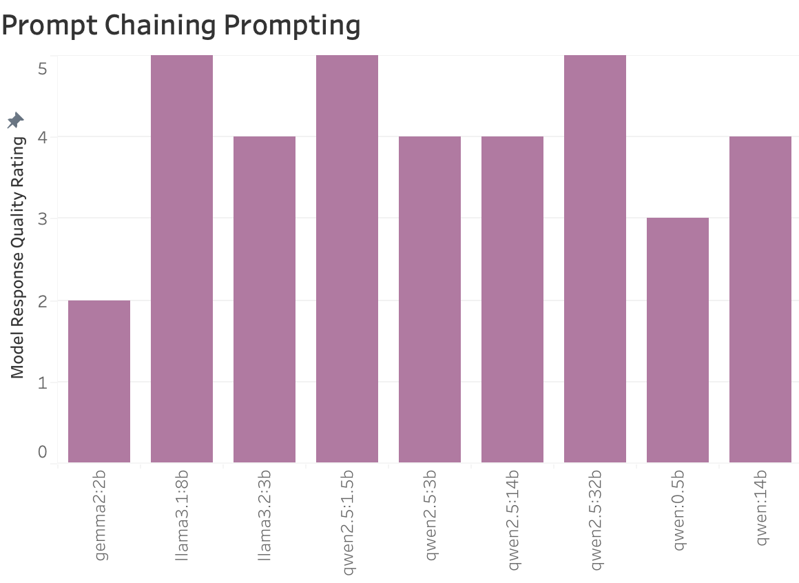
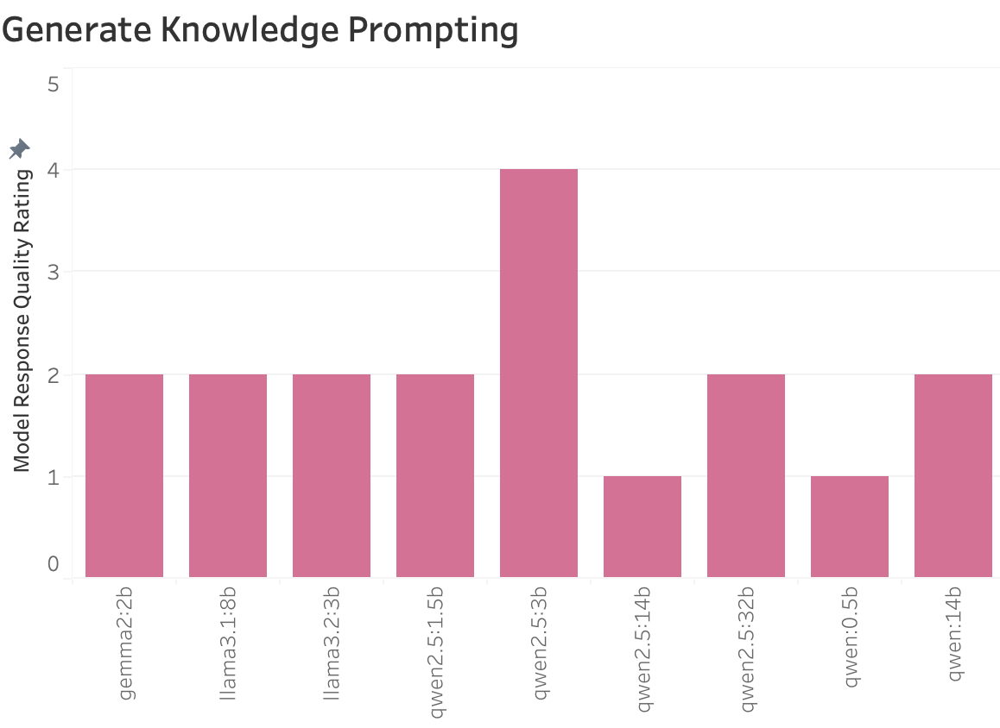

# Enhancing Requirement Analysis in the SDLC Using Large Language Models (LLMs)

This project explores how well LLMs can generate requirement analysis for software development use cases, improving efficiency in the SDLC process.

* Authors: [Paulina DeVito](https://www.linkedin.com/in/paulina-devito-fau/)
* Academic Supervisor: [Dr. Fernando Koch](http://www.fernandokoch.me)

> [!IMPORTANT] 
> This project was created for learning purposes only. ***Please refrain from copying, sharing, and/or using any of this work.*** Thank you.

---

  

# Research Question 

How do different prompt engineering techniques impact the effectiveness of LLMs in performing requirement analysis across various models and parameters?

## Arguments

#### What Is Already Known About This Topic

- [x] You could use prompt engineering techniques to optimize LLM performance for specific tasks.
- [x] The challenges of selecting the right prompt engineering strategy depend on multiple factors such as task complexity and model complexity.
- [x] The possibility of improving LLM output consistency and accuracy depends on the combination of the prompt engineering technique, the prompt itself, the model parameters (temperature, context window, etc.), and model itself.
- [x] Different LLM architectures and configurations may respond differently to prompt variations.
- [x] Gen AI in the SDLC (software development lifecycle) process can be excellent for problem identification and solution ideation, but it may also have potential for requirement analysis.
- [x] Requirement analysis in software development traditionally relies on structured methodologies, but LLMs offer a new, flexible approach.

#### What This Research Is Exploring

* This study employs a structured comparison of multiple prompt engineering techniques, such as few-shot prompting and meta-prompting, for coming up with requirement analysis for a use case.
    * The example use case used in this study is as follows:
        > An AI-powered Discord chatbot to serve as a learning companion in a classroom. The bot will act as a study buddy by handling Q&A, explanations, and study tips. It should leverage natural language understanding and domain-specific knowledge to assist students. The bot must also be designed to prevent students from using it for cheating.`

#### Implications for Practice

The implications of using LLMs for requirement analysis in the SDLC (software development lifecycle) are as follows: 

- [x] It will be easier to document requirements.
    - LLMs can generate structured requirement documents quickly, reducing manual effort.  
- [x] It will optimize the requirement gathering process.
    - Faster iterations and refinements can be made by leveraging automated suggestions.  
- [x] It will accelerate early-phase prototyping.
    - Generated requirements can be used as a foundation for wireframes and system design.  
- [x] It will reduce inconsistencies in requirement specifications.
    - With the right prompting, LLMs can enforce structured formats and standardize terminology.  
- [x] We will better understand gaps in functional and non-functional requirements.
    - LLMs can prompt for missing elements, ensuring a comprehensive requirement set.  

---

# Research Method

An experimental study was conducted where different prompt engineering techniques are applied to LLMs tasked with performing requirement analysis for a study chatbot system. Key aspects of the research method include:

1. Testing a variety of LLMs across different configurations.
2. Evaluating prompt engineering variations, including zero-shot, few-shot, and chain-of-thought prompting, using these models.
3. Measuring performance using subjective ranking evaluation (see below).
    

## Ranking Scale

GPT was prompted to give scores to each LLM requirement analysis response (see [how GPT-4o was prompted for evaluation](https://chatgpt.com/share/67bf9edb-e404-8010-b19b-97cedc7de293) for more details). Scores were delegated as follows:
- **5** (Excellent): Clear, structured requirements, includes relevant technologies, considers feasibility, and addresses the "no cheating" constraint effectively.
- **4** (Good): Mostly complete, has some tech specifics but lacks clarity or feasibility in some aspects.
- **3** (Average): Covers general requirements but is vague, missing key details or lacks real-world tech.
- **2** (Poor): Very broad, lacks structure, minimal details relevant to the use case.
- **1** (Very Poor): Irrelevant or nonsensical response.

> [!NOTE] 
> All results from each prompt technique & model run were logged in a CSV file, which can be found in the repo.

---

# Results

The results reveal notable differences in model performance across various prompt engineering techniques. Each method influenced the quality of the requirement analysis responses, with some techniques proving more effective in eliciting structured, detailed, and relevant requirements.

### Zero-Shot Prompting

- Zero-shot prompting performed well, but not best.
- The best models (**qwen2.5:3b, llama3:1:8b**) still managed decent results (4), but many struggled with achieving extra specificity in the requirement analysis.

### Few-Shot Prompting

- Few-shot prompting performed exceptionally well, with **llama3.1:8b, llama3.2:3b, qwen2.5:3b, qwen2.5:14b, qwen2.5:32b,** and **qwen:14b** all achieving top scores (5).
- This approach was one of the most consistent in improving response quality across models.
- The smallest model, **qwen:0.5b**, had difficulty incorporating examples effectively, scoring the lowest (1). Given the size of the model, this is not surprising. 
- The success of this method highlights the importance of providing models with context to generate comprehensive requirement analyses.

### Prompt Template Prompting

- Performance was mixed, with strong scores for **llama3.1:8b, qwen2.5:1.5b,** and **qwen2.5:3b** (5), but lower results for smaller models and even some shockingly lower results for the larger **qwen** models.
- The effectiveness of this method depended on the template's clarity and the model's ability to adapt structured input into detailed requirements.
- While better than zero-shot approaches, it was not as consistently effective as few-shot or COT.

### Chain-of-Thought (COT) Prompting

- COT prompting significantly improved responses for **llama3.2:3b, qwen2.5:3b,** and **qwen2.5:14b**, all achieving the highest rating (5). This means that these models benefited from structured reasoning.
- Smaller models like **gemma2:2b** struggled, producing only general responses (2).
- COT helped mid-sized models but was not uniformly effective, indicating that some models require additional prompt fine-tuning to leverage this approach.

### Meta Prompting

- This method with Level 0 Automation yielded strong results for **llama3.2:3b and qwen2.5:32b**, achieving a perfect score (5).
- However, shockingly, with Level 1 Automation meta prompting, most models struggled more. This could be for the following reasons: 
    - **Lack of Context Retention** – Each prompt may not retain the context from the previous one, meaning some details might be missed.  
    - **Over-Specification Risk** – Overly rigid constraints might limit creative and diverse responses.  
    - **Assumption Dependency** – The effectiveness depends on assumed knowledge specific to the use case and requirement analysis.  
    - **Complexity Management** – An extra layer of prompting may lead to convoluted or impractical responses.  
    - **Iteration Overhead** – Refining prompts iteratively to get the desired output is more cost inefficient than Level 0 Automation (no prompt refinement).  

> [!NOTE] 
> Level 0 Automation means a user asks a prompt to an LLM and receives a response. Level 1 Automation means a user asks an LLM for a prompt, which gets sent to another LLM to receive a response. Essentially, Level 1 Automation is "prompting for a prompt"!

### Self-Consistency Prompting

- This method was highly effective, with **qwen2.5:32b** and **qwen:0.5b** achieving perfect scores (5).
- Most other models performed decently (scores: 3-4).
- This indicates that multiple response generations may have helped improve quality, but some models lacked the refinement to self-correct.

### Prompt Chaining

- Similar to few-shot prompting, this method was highly effective for many models, three of which achieved top ratings (5).
- Mid-tier models like **qwen2.5:3b** and **qwen2.5:14b** also responded well (4).
- However, some of the smaller models again underperformed, showing that the ability to retain and build upon previous prompts may depend on the model's architecture and parameter count.

### Generate Knowledge Prompting

- This method had relatively poor results, with only **qwen2.5:3b** performing significantly better than others (4).
- Many models scored lower (2), indicating difficulties in generating domain-specific knowledge without explicit direction.
- This suggests that knowledge generation may not be as effective as structured reasoning or examples in prompting requirement analysis.

## Key Takeaways
1. **Few-shot and prompt chaining prompting were the most effective techniques** across models, consistently yielding high-quality, structured requirement analyses.
2. **Chain-of-Thought and meta prompting improved performance** for some larger models but tended to be more inconsistent for smaller ones.
3. **Generate knowledge prompting performed the worst,** with responses often lacking detail, structure, or applicability.
4. **Model size may play a heavy role in the quality of responses regardless of advanced prompting techniques.** Larger models like **qwen2.5:3b and llama3:2:3b** typically did well, while smaller ones, such as **qwen:0.5b**, struggled.

---

# Further Research

* Try more combinations of model parameter configurations.
* Test more models.
* Continue to fine-tune prompts for each prompt engineering method.

